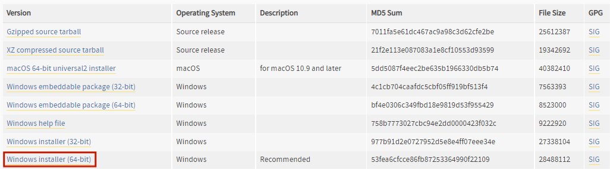
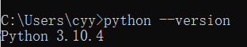
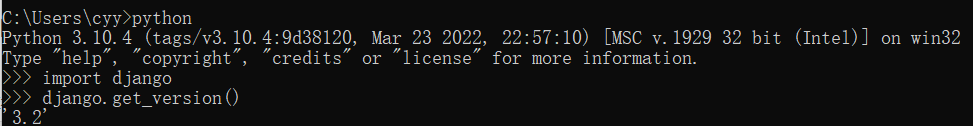
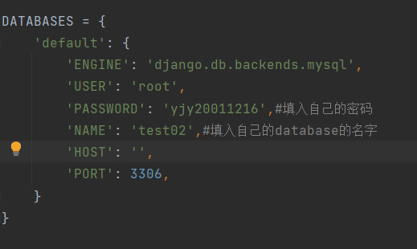
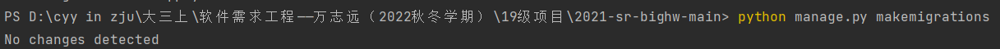
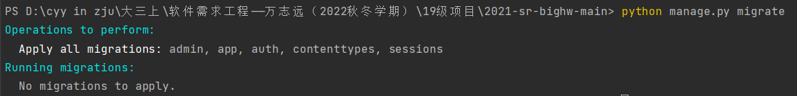
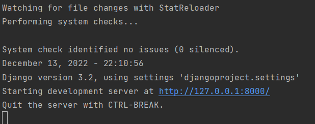
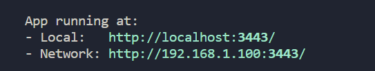

## Readme——xxyyz

### 项目用途

旨在帮助开发者和代码分析者对Pytorch项⽬进⾏项⽬分析、⽐较，以更好地从更多维度了解Pytorch项目的各个方面。

### 后端安装及运行

#### 安装（以windows 11 x64 为例）：

- 安装`Python`

  - 进入https://www.python.org/downloads/ 选择`Python 3.10.4`，并选择`Windows installer(64-bit)`，下载压缩包。

  

  - 解压缩并保持默认选项一直选择下一步直至安装完成。
  - 验证安装——终端输入`python --version`，显示`Python`版本。

  

- 安装`Django`

  - 终端输入`python -m pip install django==3.2`。
  - 验证安装——终端输入`python`,再输入`import django`,最后输入`django.get_version()`，显示`Django`版本。

  

- 配置`Mysql`

  - 安装`Mysql`（在此不作赘述）。
  - 在`Mysql`中用`create database xxyyz`创建数据库（`xxyyz`任意填写）。
  - 修改项目中的`./djangoproject/setting.py`，填入自己的数据库名和密码。

  

- 运行后端

  - 数据库建立与同步

    - 在项目根目录运行终端，输入`python manage.py runserver`。

    

    - 继续输入`python manage.py migrate`

    

  - 在项目根目录运行终端，输入`python manage.py runserver`,出现如下图所示内容，即成功运行。



- 同步数据库

	启动前端后，访问http://127.0.0.1:8000/tttt，执行初始化程序。注意，初始化的进度会在控制台打印，此过程通常需要20分钟左右。成功后会在浏览器显示成功提示信息。

	如果无法初始化成功，也可以使用我们在2022-12-16的数据库备份，在根目录下的data目录中即可以看到所用数据库表的csv文件，手动导入即可。

	若需获取更新，请启动前端后访问http://127.0.0.1:8000/uuuu。注意需要本地有PyTorch和Pandas的完整克隆仓库，并将地址填写在`app/views.py`的对应函数`commit_update_main(request)`中“执行更新“段落。

### 前端安装及运行

#### 安装（以windows 10 x64 为例）

+ 安装`nodejs` 和`npm`该项目`node`版本为`v16.17.1 ` 	`npm`版本为`8.15.0  `

+ 进入项目`vue-admin-template`文件夹中

  + 输入如下命令

  ```
  npm install --legacy-peer-deps
  npm run dev
  ```

  ​			看到显示

  

  即为成功运行

+ 可以点击上述链接进入项目